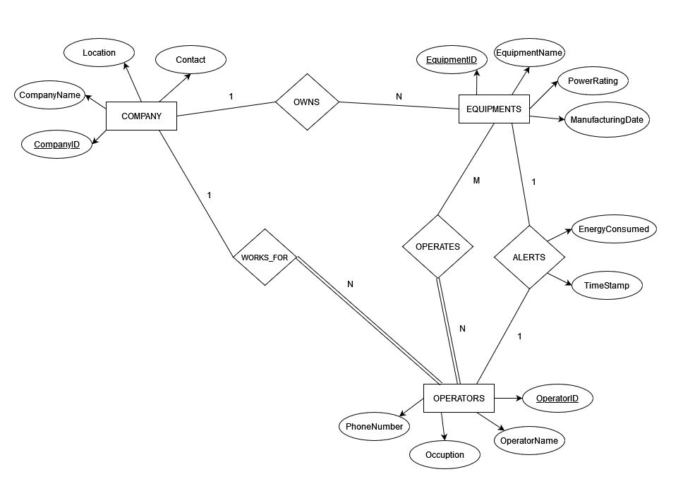

# Database Requirements

<div style="text-align: center; text-decoration: underline; margin-top: 5rem">
    <h3 style="margin: 0;">ER Diagram</h3>
    
    <h3 style="margin: 0;">Relational Schema</h3>
    
</div>

## Table Creation 

```
CREATE TABLE COMPANY (
    CompanyID varchar(20),
    CompanyName varchar(30),
    Location varchar(30),
    Contact integer,
    PRIMARY KEY (CompanyID)
);
```
```
CREATE TABLE EQUIPMENTS (
    EquipmentID varchar(20),
    EquipmentName varchar(30),
    PowerRating integer,
    ManufacturingDate date,
    CompanyID varchar(20),
    PRIMARY KEY (EquipmentID),
    FOREIGN KEY (CompanyID) REFERENCES COMPANY(CompanyID)
);
```
```
CREATE TABLE OPERATORS (
    OperatorID varchar(20),
    OperatorName varchar(30),
    Occupation varchar(20),
    PhoneNumber integer,
    CompanyID varchar(20),
    PRIMARY KEY (OperatorID),
    FOREIGN KEY (CompanyID) REFERENCES COMPANY(CompanyID)
);
```
```
CREATE TABLE ALERTS (
    AlertID varchar(20),
    EquipmentID varchar(20),
    OperatorID varchar(20),
    EnergyConsumed integer,
    TimeStamp timestamp,
    PRIMARY KEY (AlertID),
    FOREIGN KEY (EquipmentID) REFERENCES EQUIPMENTS(EquipmentID),
    FOREIGN KEY (OperatorID) REFERENCES OPERATORS(OperatorID)
);
```
```
CREATE TABLE OPERATES (
    OperatorID varchar(20),
    EquipmentID varchar(20),
    PRIMARY KEY (OperatorID, EquipmentID),
    FOREIGN KEY (OperatorID) REFERENCES OPERATORS(OperatorID),
    FOREIGN KEY (EquipmentID) REFERENCES EQUIPMENTS(EquipmentID)
);
```